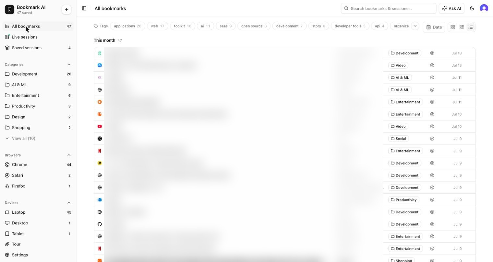
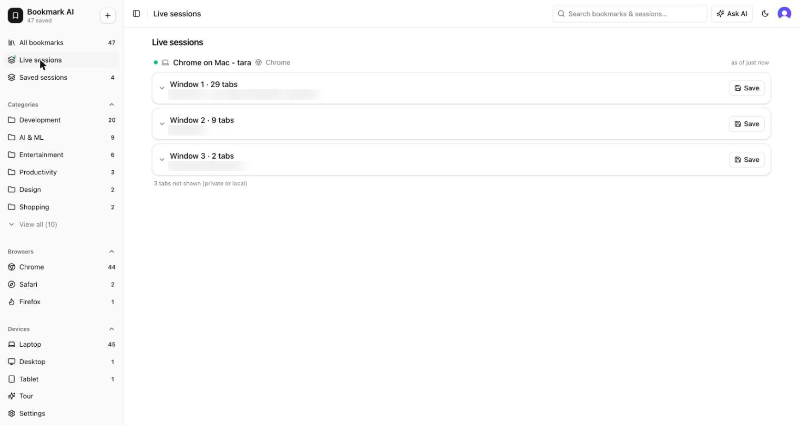
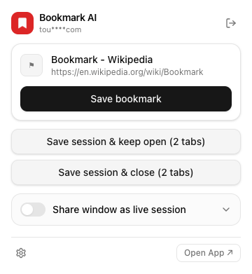
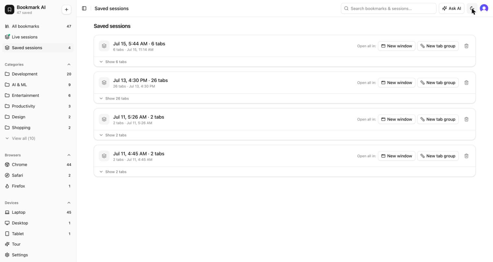

<div align="center">


# Bookmark AI

**Save bookmarks from any browser → AI categorizes, tags, and embeds them → search by meaning → snapshot tab sessions → mirror your live tabs across devices.**

[](LICENSE)
[](#contributing)

[Hosted app](https://bookmark-ai.cloud) · [Docs](https://docs.bookmark-ai.cloud) · [Architecture](docs/ARCHITECTURE.md)

</div>

---

Bookmark AI turns "I'll save this for later" into something that actually works later. Save a page in one click from **any browser, on any device** — the API scrapes its Open Graph data (title, description, preview image, site, favicon), an AI pass categorizes and tags it, and an embedding makes it findable by meaning instead of exact keywords. Everything lands in a library you can browse and search from a **web app**, a **cross-browser extension** (Chrome / Firefox / Safari), an **iOS/Android app** (Expo), and a **native macOS desktop app** (Zig). You can snapshot every open tab as a **saved session** and restore it later, opt in to **live tabs** mirrored in real time across your signed-in devices, and **chat with an AI agent** that searches your own bookmarks.

## Screenshots

| Library — filed, tagged, searchable | Live tabs across devices |
| --- | --- |
|  |  |

| One-click save from the extension | Saved tab sessions |
| --- | --- |
|  |  |

## Features

- **One-click save** — click the toolbar icon (or `Alt+Shift+S`) and the page is saved with its title, icon, and link. No folders to maintain.
- **AI does the filing** — every save is read, categorized, and tagged automatically. Tags converge on a shared vocabulary so your library stays tidy.
- **Search by meaning** — hybrid search blends full-text (FTS5 + BM25) with semantic vectors, so a vague memory like *"that article about focus"* finds the page even when those words never appear on it.
- **Save whole sessions** — snapshot an entire window of tabs as one session, then restore the set later as a tab group.
- **Live tabs, on every device (opt-in)** — turn on "Share window as live session" and your open tabs appear on your other devices in real time. Off by default; private windows are never sent, credential-looking URLs are reduced to their origin, and live data expires automatically after 7 days.
- **Chat with your bookmarks** — an AI agent (AI SDK v7) answers questions over your library using full-text and semantic search tools.
- **Everywhere** — web, browser extension (Chrome MV3 / Firefox MV2 / Safari), iOS + Android (Expo), and a native macOS desktop app (Zig).
- **Private by design** — nothing is collected beyond what makes your own library work, and live sharing is strictly opt-in.

## Architecture at a glance

A Turborepo + pnpm monorepo. One rule keeps every surface thin: **clients only construct a `CreateBookmarkInput` and POST it** — the API owns scraping, categorization, embedding, and search.

| Path | What it is |
| --- | --- |
| `apps/web` | Next.js 15 + shadcn/ui web app — **and the API itself** (`app/api/*` route handlers, deployed as Vercel functions; the same code serves local dev on `:3000`) |
| `apps/extension` | WXT + React popup → Chrome MV3 / Firefox MV2 / Safari |
| `apps/mobile` | Expo (React Native) iOS / iPad / Android app |
| `apps/desktop` | Native SDK (vercel-labs/native, Zig) macOS app |
| `apps/live-server` | Dedicated live-tabs server — Fastify + Redis + SSE, runs on a VM (offloads high-frequency ephemeral traffic off Vercel/Turso) |
| `packages/engine` | Shared save/search pipeline: OG scrape, Gemini categorize/embed, RRF hybrid search. The web API routes are a thin adapter over it |
| `packages/db` | libSQL client + schema (FTS5 triggers + `F32_BLOB(768)` vector column) + query modules, backed by [Turso](https://turso.tech) in production |
| `packages/types` | Zod schemas — **the** API contract every surface shares |
| `packages/ui` | Design tokens (`theme.css`) + shared React components |

Full data flow, design decisions, and roadmap: [`docs/ARCHITECTURE.md`](docs/ARCHITECTURE.md).

## Self-hosting quickstart

Bookmark AI runs with **zero external services** — no Clerk, no Gemini, no Turso required to start. Leaving the auth keys unset opens the API in keyless self-host mode; leaving `DATABASE_URL` at a local `file:` path uses a local SQLite database; leaving `GEMINI_API_KEY` unset degrades AI features to heuristics with `fallback: true`.

**Requirements:** Node ≥ 20, [pnpm](https://pnpm.io).

```bash
git clone https://github.com/Tarachand-Gupta/bookmark-ai.git
cd bookmark-ai
pnpm install
cp .env.example .env          # defaults work as-is for local, keyless mode

pnpm --filter @bookmark-ai/web dev   # → http://localhost:3000 (web UI + /api)
```

That's it — open http://localhost:3000. With no Clerk keys the pages are ungated and the API is open; with no `GEMINI_API_KEY` categorization falls back to domain/keyword heuristics and search is full-text only; with no `DATABASE_URL` (or a `file:` one) your data lives in a local SQLite file.

**Turn on the real thing (all optional):**

| Want | Set in `.env` |
| --- | --- |
| AI categorization, embeddings & chat | `GEMINI_API_KEY` — [get one free](https://aistudio.google.com/apikey) |
| Sign-in / multi-user auth | Clerk publishable + secret keys (a free [Clerk](https://clerk.com) instance) |
| Cloud database | `DATABASE_URL` = your `libsql://…` [Turso](https://turso.tech) URL + `DATABASE_AUTH_TOKEN` |
| Live tabs across devices | run `apps/live-server` (Redis + Fastify) — see its `docker-compose.live.dev.yml` and [README](apps/live-server/README.md) |

Every variable is documented in [`.env.example`](.env.example). Other surfaces:

```bash
pnpm --filter @bookmark-ai/extension build          # extension → .output/chrome-mv3 (also :firefox, :safari)
cd apps/desktop && native dev                        # macOS app (needs Zig 0.16 + @native-sdk/cli)
cd apps/mobile && npx expo run:ios                   # mobile (needs Xcode; Android needs JDK + Android SDK)
```

> Tokenless local clients (the Zig desktop app, curl, the import script) need the API opened even in keyless mode: `DEV_OPEN_API=1 pnpm --filter @bookmark-ai/web dev`.

## Hosted version

Don't want to self-host? **[bookmark-ai.cloud](https://bookmark-ai.cloud)** is a free hosted instance run by the author. Sign in, install the extension, and start saving.

## Contributing

PRs and issues are welcome. To get started:

1. Read [`CLAUDE.md`](CLAUDE.md) — the contributor guide (monorepo map, current state, hard-won gotchas, where features go) and [`docs/ARCHITECTURE.md`](docs/ARCHITECTURE.md).
2. Before opening a PR, run `pnpm check-types` and `pnpm test`.
3. Verify against the playbook in [`docs/TESTING.md`](docs/TESTING.md) for any surface you touched.

Whole-repo scripts: `pnpm build` · `pnpm check-types` · `pnpm test` · `pnpm format`.

## License

[MIT](LICENSE) © 2026 Tarachand Gupta
